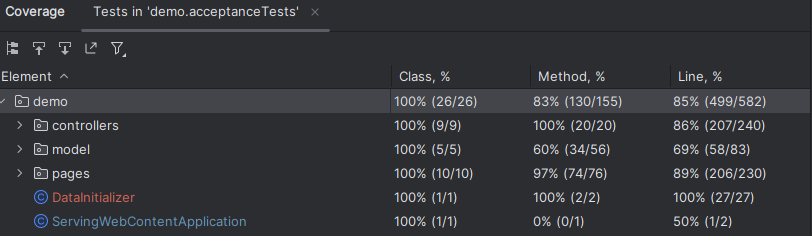
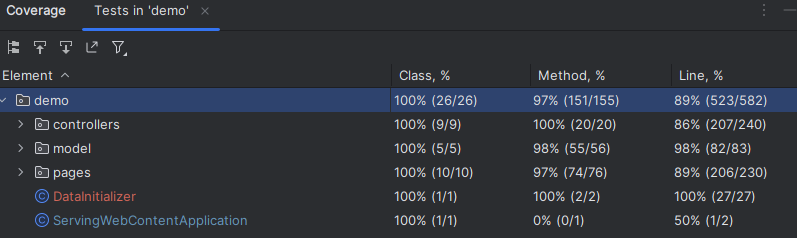

# Sistema di Gestione dei Report Accademici

## Requisiti del sistema

Il sistema offre una piattaforma intuitiva per la gestione di utenti, progetti e ore lavorative, con funzionalità personalizzate per i diversi ruoli:

## Permessi

### Amministratore:
- Creazione di nuovi progetti.
- Visualizzazione e gestione della lista dei progetti.
- Modifica e rimozione dei progetti esistenti.
- Inserimento di nuovi utenti nel sistema.

### Responsabile Scientifico (Supervisore):
- Creazione di progetti.
- Modifica dei progetti di cui è responsabile.

### Ricercatore:
- Registrazione delle presenze e delle ore lavorative sui progetti assegnati.
- Visualizzazione riepilogativa in base al progetto e al periodo mensile

## Scenari

### 1. Inserimento di un utente da parte dell'amministratore

**Assunzione iniziale:** Un amministratore autenticato desidera inserire un nuovo utente nel sistema. L'amministratore ha accesso alle credenziali iniziali del nuovo utente (ad esempio nome, cognome, email, ruolo).

**Normale:** L'amministratore accede all'interfaccia di gestione utenti e seleziona l'opzione "Inserisci utente". Compila i campi richiesti (nome, cognome, ruolo) e conferma l'operazione.

**Cosa può andare storto:**

1. L'utente con lo stesso username esiste già: il sistema notifica che l'utente non può essere duplicato.

**Stato del sistema al completamento:** L'utente viene aggiunto al database e lo stato del sistema conferma l'avvenuta creazione dell'account.

---

### 2. Cambiamento della propria password

**Assunzione iniziale:** Un utente autenticato desidera cambiare la propria password per motivi di sicurezza.

**Normale:** L'utente seleziona l'opzione "Cambia password", inserisce la password attuale, digita e conferma la nuova password.

**Cosa può andare storto:**

1. La password attuale non corrisponde: il sistema mostra un messaggio di errore.

**Stato del sistema al completamento:** La nuova password è salvata.

---

### 3. Creazione di un progetto

**Assunzione iniziale:** Un amministratore desidera creare un nuovo progetto a cui assegnare utenti.

**Normale:** L'amministratore seleziona "Crea nuovo progetto", inserisce nome, descrizione, data di inizio. Aggiunge supervisore e ricercatori al progetto e conferma. Il sistema salva il progetto.

**Cosa può andare storto:**

1. Nessun utente assegnato: il sistema avvisa che il progetto non può essere creato senza membri.

**Altre attività:** Il progetto può essere modificato dal supervisore e dagli amministratori.

**Stato del sistema al completamento:** Il progetto è creato e disponibile nella lista dei progetti.

---

### 4. Modifica di un progetto

**Assunzione iniziale:** Un amministratore o supervisore desidera aggiornare le informazioni di un progetto esistente.

**Normale:** L'amministratore accede alla lista dei progetti, seleziona "Modifica" sul progetto da modificare, aggiorna le informazioni desiderate (nome, descrizione, membri) e salva le modifiche.

**Cosa può andare storto:**

1. Nessun utente assegnato: il sistema avvisa che il progetto non può essere senza membri.

**Stato del sistema al completamento:** Le modifiche sono salvate e visibili a tutti gli utenti coinvolti.

---

### 5. Inserimento ore di lavoro da parte di un ricercatore

**Assunzione iniziale:** Un ricercatore autenticato desidera registrare le ore di lavoro su un progetto.

**Normale:** Il ricercatore accede alla sezione "Inserimento ore", seleziona il progetto e inserisce le ore lavorate nelle date desiderate (escluse festive e future), quindi conferma. Il sistema salva l'informazione e aggiorna il riepilogo delle ore lavorative.

**Cosa può andare storto:**

1. Ore lavorative superiori al massimo giornaliero consentito: il sistema restituisce un messaggio di errore.

**Stato del sistema al completamento:** Le ore sono registrate e visibili nel riepilogo.

---

### 6. Visualizzazione del riepilogo delle proprie ore lavorative per progetto, mese e anno

**Assunzione iniziale:** Un ricercatore autenticato desidera visualizzare un riepilogo delle ore lavorative.

**Normale:** Il ricercatore accede alla sezione "Riepilogo", seleziona un progetto e un periodo (mese o anno). Il sistema mostra una tabella riepilogativa con ore totali e dettagliate.

**Cosa può andare storto:**

1. Nessun dato disponibile per il periodo selezionato: il sistema avvisa l'utente.

**Stato del sistema al completamento:** Il riepilogo è visualizzato o esportato correttamente.

---

### 7. Eliminazione di un progetto

**Assunzione iniziale:** Un amministratore desidera eliminare un progetto esistente.

**Normale:** L'amministratore accede alla lista dei progetti, dopo aver visto i dettagli del progetto decide di eliminarlo. Il sistema richiede una conferma definitiva prima di procedere.

**Stato del sistema al completamento:** Il progetto è eliminato e non compare più nella lista attiva dell'admin e delle altre persone coinvolte.

---

### 8. Login, login con credenziali errate e logout

**Assunzione iniziale:** Un utente desidera accedere al proprio account e, successivamente, eseguire il logout.

**Normale:**
1. L'utente inserisce il proprio username e la password corretta, quindi clicca su "Login".
2. Se le credenziali sono corrette, l'utente viene autenticato e reindirizzato alla home page o alla dashboard.
3. L'utente seleziona l'opzione "Logout" e conferma l'uscita.

**Cosa può andare storto:**
1. Se l'utente inserisce credenziali errate (username o password sbagliati), il sistema mostra un messaggio di errore e invita a riprovare.
2. Il sistema non riesce a eseguire il logout: viene mostrato un messaggio di errore e l'utente è invitato a riprovare.

**Stato del sistema al completamento:**
- Se il login è riuscito, l'utente è autenticato e reindirizzato alla home page o alla dashboard.
- Se il logout è riuscito, l'utente è disconnesso e reindirizzato alla pagina di login o home page.

## Quality Assurance

Per garantire che il sistema funzioni correttamente, sono stati implementati due serie di testing distinti:

1. **Acceptance Testing (Selenium + Page Object Model):**
    - Utilizzato per testare gli scenari descritti nel sistema, come l'inserimento di un utente, la creazione di un progetto, l'inserimento delle ore di lavoro, ecc. Utilizzando il pattern **Page Object Model**, i test sono strutturati in modo modulare per garantire che ogni componente dell'interfaccia utente venga testato separatamente, riducendo il rischio di errori nel testing.
      
    - Vengono testati gli scenari provenienti dal processo di ingegneria dei requisiti, rendendo il processo più efficace e in linea con le necessità reali degli utenti. Gli scenari sono **realistici**, riflettono casi d'uso effettivi, e includono **più requisiti**.

2. **Unit Testing (JUnit):**
    - Testa le singole unità di codice dei model (Day,Person...) in modo indipendente. Questi test assicurano che ogni componente del sistema funzioni correttamente in isolamento, senza dipendenze da altre parti del sistema.
      

   **DayTest**

   Testa il costruttore e i metodi getter/setter della classe `Day`, che rappresenta un giorno con una data, un numero di ore lavorative e l'indicazione se è un giorno festivo.
   
   **PersonTest**

   Verifica i costruttori (predefinito, parametrico e minimo) e i metodi getter/setter della classe `Person`, che modella un utente con attributi come nome, cognome, codice fiscale, username, password e ruolo (`Role`).

   **ProjectTest**

   Testa il costruttore e i metodi getter/setter della classe `Project`, che rappresenta un progetto con attributi come nome, descrizione, mese, anno, ente finanziatore, supervisore, ricercatori e registri di lavoro. I test includono la verifica della corretta impostazione e ottenimento di questi attributi e delle relative modifiche.

   **WorkLogTest**
   
   Testa il costruttore e i metodi getter/setter della classe `WorkLog`, che rappresenta un registro di lavoro associato a un ricercatore e a un progetto, con attributi come data, ore lavorate, ricercatore e progetto. I test verificano la corretta impostazione e ottenimento di questi attributi e le modifiche tramite i metodi setter.

### Coverage Totale

# Inizializzazione del Sistema

Per eseguire le fasi di test, il sistema è stato inizializzato con un insieme di utenti predefiniti appartenenti a diversi ruoli. Alcune credenziali di accesso predefinite per i vari utenti sono le seguenti:

- **Amministratore**:
   - Username: `admin`
   - Password: `admin`

- **Supervisore**:
   - Username: `supervisor`
   - Password: `supervisor`

- **Ricercatore**:
   - Username: `researcher`
   - Password: `researcher`

Il sistema è stato popolato con alcuni progetti di esempio, ciascuno con un supervisore assegnato e un gruppo di ricercatori dedicati.

- **Project 1**: AI Research
   - **Supervisore**: `supervisor`
   - **Ricercatori**: `researcher1`, `researcher2`, `researcher`

- **Project 2**: Space Exploration
   - **Supervisore**: `supervisor2`
   - **Ricercatori**: `researcher3`, `researcher4`, `researcher`

- **Project 3**: Renewable Energy Solutions
   - **Supervisore**: `supervisor1`
   - **Ricercatori**: `researcher1`, `researcher3`, `researcher`

- **Project 4**: Climate Change Analysis
   - **Supervisore**: `supervisor2`
   - **Ricercatori**: `researcher2`, `researcher4`, `researcher`

### Conclusioni

- Il sistema presenta un'ottima copertura per i **controller** e **modelli**, con una copertura quasi totale per le **pages** (scenari di test). Questo indica che le funzioni principali sono testate in modo rigoroso.
- Sono stati identificati alcuni punti di miglioramento nella copertura dei **metodi** in **ServingWebContentApplication**, dove il testing potrebbe essere esteso per garantire una maggiore robustezza.
- La qualità del codice è mantenuta alta grazie a una solida implementazione di test a livello sia di unità che di accettazione.

I test di **Acceptance** garantiscono che i flussi utente siano corretti, mentre i **Unit Test** assicurano la correttezza del codice backend.

